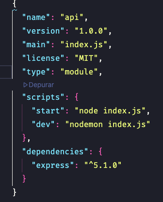

## Estudos de node js

##### Instalar o node para usar javascript nos projeto

> Iniciando o package.json

```javascript
  -> Criando o pagckage.json
  npm init -y

  -> Instatalando o Express
  yarn add express
  ->

```

###### Adicionando algumas observacoes

---

> para usar a sintaxe de import export<br>
> precisa configura no package.json
> type: modules

```json
{
  "type": "module"
}
```



**Imagem a cima mostra como fica o package.json ☝️**

### MÉTODOS HTTP

- **GET**: Busca um ou vários registros do banco de dados.
- **POST**: Insere um novo registro no banco de dados.
- **PATCH**: Atualiza parcialmente um registro existente no banco de dados.
- **PUT**: Atualiza totalmente um registro existente no banco de dados.
- **DELETE**: Remove um ou mais registros
